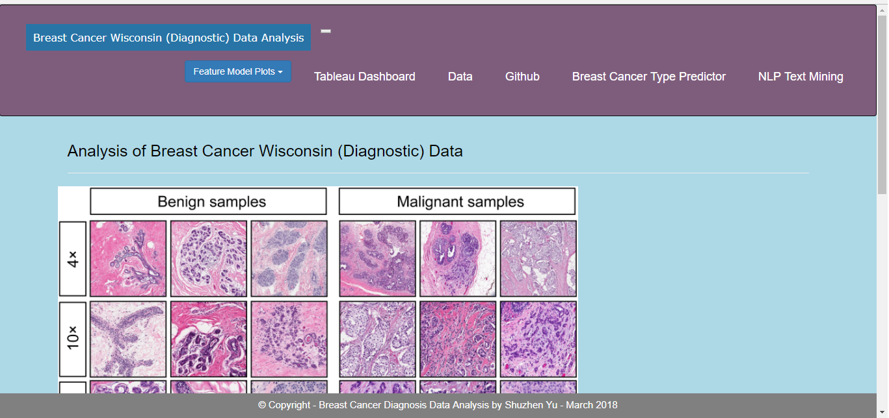

# Breast-Cancer-Diagnosis-Data-Analysis
## Please click image to see the project data visualization

## https://syu2017.github.io/Breast-Cancer-Diagnosis-Data-Analysis-MachineLearning-NLP/

## https://breast-cancer-diagnosis.herokuapp.com/

## https://public.tableau.com/profile/shuzhen.yu#!/vizhome/Book2_20270/Dashboard1?publish=yes

## This project analyzes and visualizes patients’ data collected from UC Irvine Machine Learning Repository to provide dashboards and deploy Flask app on Heroku for a user to classify breast tumors as malignant or benign.  
## Used Python, Seaborn, Machine Learning(Scikit-learn), NLP and Tableau to analyze data. Then used JavaScript, HTML/CSS and Flask app to create dashboards and graph the data.

